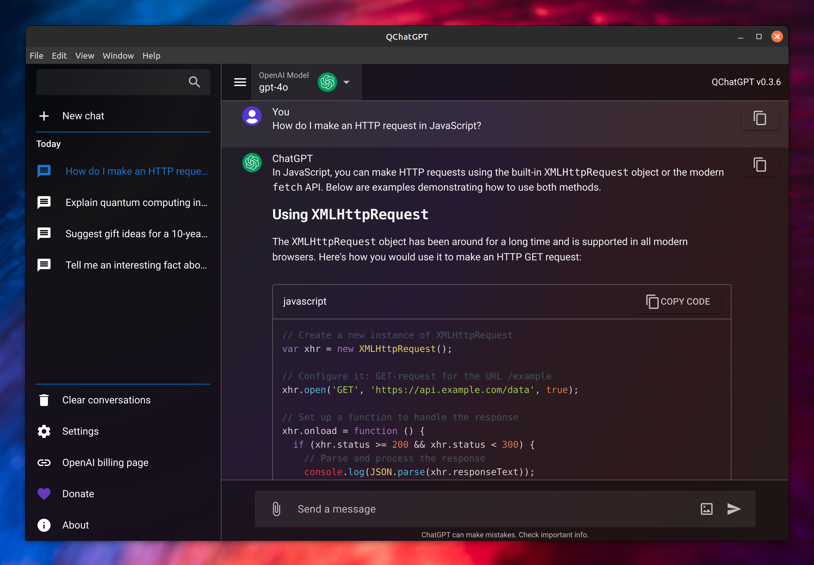

<p align="center">
  
  <h1 align="center">QChatGPT</h1>
  <p align="center">ChatGPT cross-platform client made with Quasar Framework (Linux, Windows, Mac, Android and iOS)</p>
</p>



## Builds

|Platform|Available||
|--------|---------|--|
|<p> Linux 64 </p>|✔|[Download](https://github.com/timamus/QChatGPT/releases/latest)|
|<p> Windows 64 </p>|✔|[Download](https://github.com/timamus/QChatGPT/releases/latest)|
|<p> MacOS arm64 </p>|✔|[Download](https://github.com/timamus/QChatGPT/releases/latest)|
|<p> Android 64 </p>|✔|[Download](https://github.com/timamus/QChatGPT/releases/latest)|
|<p> iOS </p>|❌| |

## Features

- **Cost-efficient Requests**: Pay only for the requests you make using the ChatGPT API key.
- **Local Data Storage**: Chats are stored on your device, ensuring stable operation and access to history.
- **Real-time Support**: Operate seamlessly in real time.
- **Model Updates**: Receive new models without needing to update the application.
- **Syntax Highlighting**: Supports over 20 popular programming languages.
- **Image Generation**: Create images using Dall-E 3.
- **Search Functionality**: Quickly find the information, chat, or message you need with search across chat lists and within chats.
- **Automatic Chat Grouping by Timeline**: Chats are organized by time for convenient viewing and navigation.

## Install the dependencies
```bash
yarn
# or
npm install
```

### Start the app in development mode (hot-code reloading, error reporting, etc.)
```bash
yarn quasar dev
# or
quasar dev
```


### Lint the files
```bash
yarn lint
# or
npm run lint
```


### Format the files
```bash
yarn format
# or
npm run format
```


### Build the app for production
```bash
yarn quasar build
# or
quasar build
```

### Customize the configuration
See [Configuring quasar.config.js](https://v2.quasar.dev/quasar-cli-vite/quasar-config-js).

## Create a .desktop file for Linux

After unpacking the file 'QChatGPT-linux-x64.zip' into the home directory, execute the command:

```
echo "[Desktop Entry]
Type=Application
Name=QChatGPT
Comment=Qchatgpt
Exec=$HOME/QChatGPT-linux-x64/QChatGPT
Icon=$HOME/QChatGPT-linux-x64/icon.png
Terminal=false
StartupNotify=true
Categories=Utility;" > $HOME/.local/share/applications/QChatGPT.desktop
chmod +x $HOME/.local/share/applications/QChatGPT.desktop
update-desktop-database $HOME/.local/share/applications
```

<div align="center">
  <a href="https://paypal.me/tmusab">
    
  </a>
</div>
